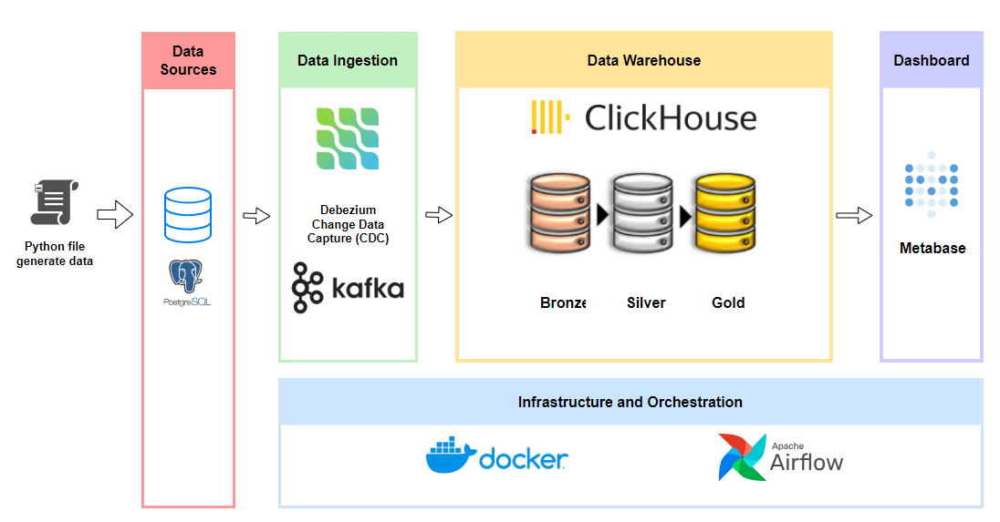
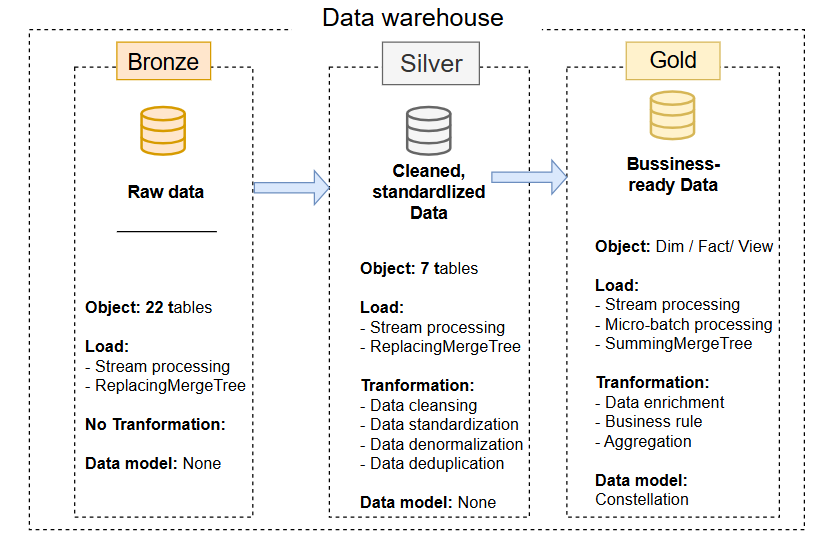
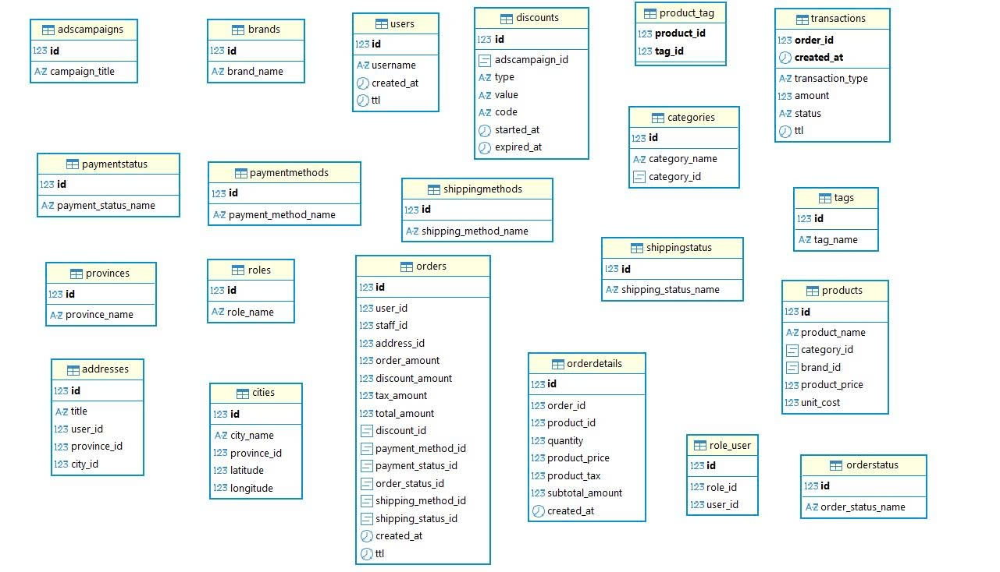
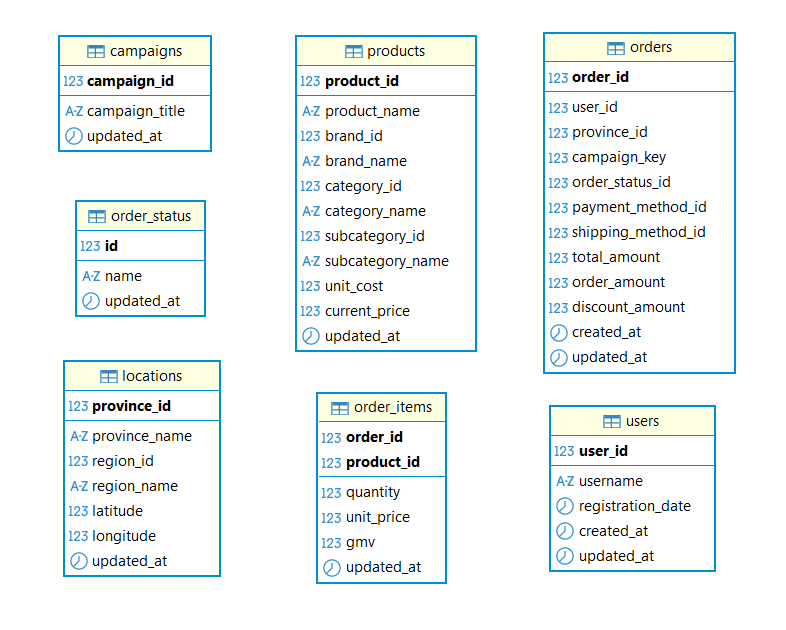
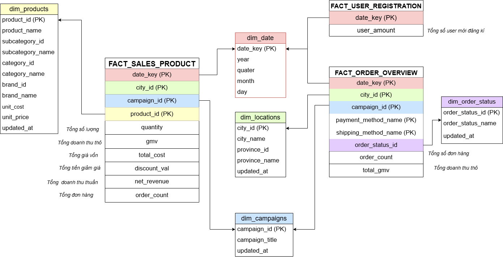
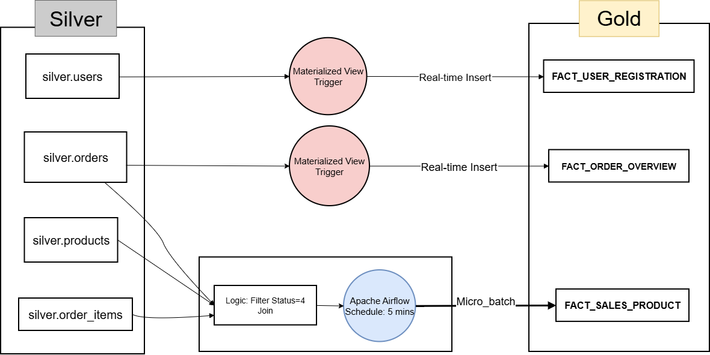
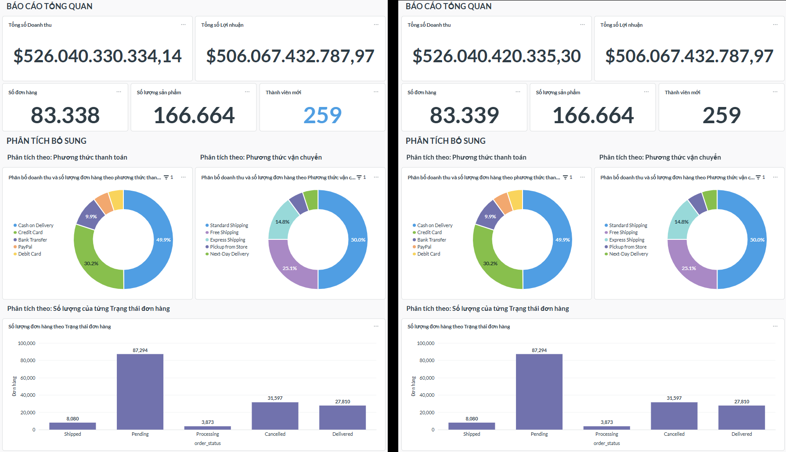
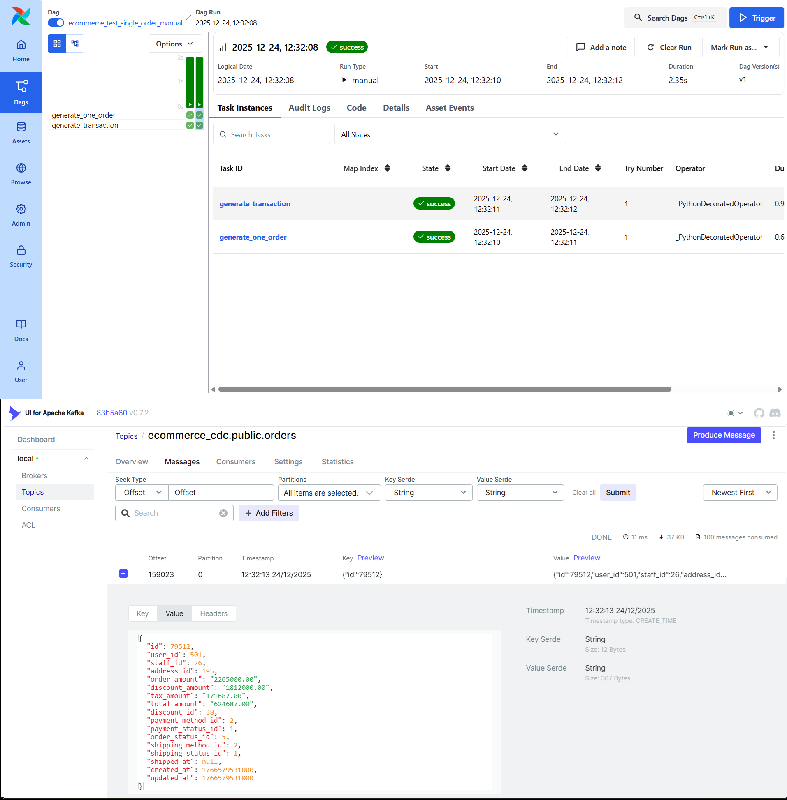
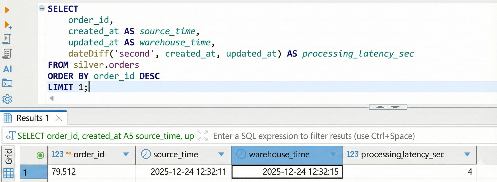

# E-Commerce Real-time Data Pipeline

<p align="center">
  
  
  
  
  
  
  
</p>

An end-to-end, production-grade near real-time data pipeline capturing transaction events from an e-commerce transactional database (OLTP) via **Change Data Capture (CDC)** and streaming them through **Apache Kafka** into a **ClickHouse Analytical Data Warehouse (OLAP)** modeled with the **Medallion Architecture**, visualized through **Metabase BI Dashboards**.

---

## Table of Contents

- [1. Business Context & Problem Statement](#1-business-context--problem-statement)
- [2. System Architecture](#2-system-architecture)
- [3. Data Warehouse & Medallion Modeling](#3-data-warehouse--medallion-modeling)
- [4. Tech Stack](#4-tech-stack)
- [5. Dashboards & Final Visualizations](#5-dashboards--final-visualizations)
- [6. End-to-End Verification & Latency Benchmark](#6-end-to-end-verification--latency-benchmark)
- [7. Quick Start & Operational Scripts](#7-quick-start--operational-scripts)
- [8. Detailed Setup Guides](#8-detailed-setup-guides)
- [9. Future Engineering Roadmap](#9-future-engineering-roadmap)

---

## 1. Business Context & Problem Statement

### The "OLTP Breaking Point" in Modern E-Commerce
In modern 24/7 e-commerce environments, transaction volume can spike dramatically during promotional events and flash sales. Traditionally, reporting queries were executed directly against the primary transactional database (OLTP):

- **Query Latency Degrades Exponentially**: At ~100 orders/min, simple operational aggregation takes < 1 second. When transaction volume climbs to 500–1,000+ orders/min, analytical queries joining 4–5 transactional tables take 25–40 seconds.
- **Resource Contention & Deadlocks**: Long-running read queries lock transactional rows and pages, starving checkout APIs and leading to shopping cart timeouts.
- **Scattered Data & Stale Batch ETL**: Traditional nightly batch ETL pipelines produce reports delayed by 12–24 hours, making real-time campaign adjustments impossible.

### The Decoupled Streaming Solution
This project implements a decoupled, parallel **OLTP–OLAP architecture**:
1. Transactional writes remain lightweight and isolated on PostgreSQL.
2. Low-overhead **Change Data Capture (CDC)** extracts row modifications directly from the database Write-Ahead Log (WAL) with sub-second latency.
3. High-throughput message streaming via **Kafka** buffers and decouples data generation from downstream consumption.
4. **ClickHouse** columnar storage executes aggregations across millions of records in milliseconds using specialized MergeTree engines.

---

## 2. System Architecture



### Data Flow Lifecycle
1. **Source Simulation (OLTP)**: Apache Airflow coordinates realistic e-commerce traffic (users, addresses, product tags, promotions, orders, line items, and payment transactions) into **PostgreSQL 15**.
2. **Change Data Capture (CDC)**: **Debezium Connect** tails PostgreSQL's logical replication stream (`pgoutput`), converting row changes into JSON events without imposing query overhead on the source database.
3. **Event Streaming (Kafka)**: **Apache Kafka (KRaft mode)** distributes change events across 22 discrete topics with a 7-day retention window.
4. **Analytical Data Warehouse (ClickHouse)**: ClickHouse consumes events directly via native Kafka engines, passing data sequentially through Bronze, Silver, Gold, and Report layers.
5. **Business Intelligence (Metabase)**: Connects to ClickHouse's reporting views, serving real-time KPI cards, sales funnels, and marketing performance dashboards.

---

## 3. Data Warehouse & Medallion Modeling

The warehouse is structured according to the industry-standard **Medallion Architecture**:



### 🥉 Bronze Layer — Raw Event Ingestion
Consists of 22 raw tables ingesting directly from Kafka CDC topics via ClickHouse's native Kafka Table Engine and Materialized Views.
- **Parallel Consumers**: High-throughput entities (`orders`, `orderdetails`) use `kafka_num_consumers = 4` to saturate CPU cores.
- **Fault Tolerance**: Includes `kafka_skip_broken_messages = 10` to guarantee uninterrupted streaming.
- **Deduplication**: Backed by `ReplacingMergeTree(_version)` using the source record timestamp as the sorting version.



### 🥈 Silver Layer — Cleansing, Conformance & Denormalization
Cleanses raw events and denormalizes normalized transactional schemas into 7 unified tables:
- **Timezone Normalization**: Automatically converts PostgreSQL Asia/Ho_Chi_Minh (+7) timestamps to UTC via `(created_at - INTERVAL 7 HOUR)`.
- **Merged Dimensions**: 
  - `provinces` + `regions` $\rightarrow$ `silver.locations`
  - `products` + `categories` (parent/child) + `brands` $\rightarrow$ `silver.products`
  - `orders` enriched with addresses, campaigns, and delivery methods $\rightarrow$ `silver.orders`
- **Computed Line-Item Metrics**: `silver.order_items` pre-calculates `gmv = quantity * current_price`.



### 🥇 Gold Layer — Business-Ready Dimensional Modeling
Structured as a **Galaxy / Constellation Schema** with conformed dimensions and specialized facts:



#### Conformed Dimensions (`ReplacingMergeTree`)
- `gold.dim_date`: Pre-generated 10-year calendar table (2020–2029).
- `gold.dim_products`: Conformed product dimension seeded with row `0: 'Unknown'`.
- `gold.dim_locations`: Geographic dimension with fallback `0: 'Unknown'`.
- `gold.dim_campaigns`: Marketing campaign dimension seeded with `0: 'No_Campaign'`.
- `gold.dim_order_status`: Standard order lifecycle status lookup (5 states).

#### Fact Ingestion Strategy: Stream vs. Micro-Batch



1. **Continuous Real-Time Streaming (Materialized Views)**:
   - `FACT_USER_REGISTRATION`: Auto-aggregates daily customer signups using `SummingMergeTree`.
   - `FACT_ORDER_OVERVIEW`: Continuously aggregates order volume and total GMV by date, location, delivery status, and payment method.
2. **5-Minute Micro-Batch ETL (`FACT_SALES_PRODUCT`)**:
   - Because calculating product sales requires joining three separate streams (`orders`, `order_details`, `products`) that may arrive out of order, data is aggregated in 5-minute micro-batches scheduled by Airflow.
   - **Proportional Discount Allocation Formula**: Discounts applied at the order header level are distributed across line items proportional to their revenue share:
     $$\text{Discount}_{\text{Item}} = \left( \frac{\text{Price}_{\text{Item}} \times \text{Qty}}{\text{Order\_Amount}} \right) \times \text{Discount\_Amount}$$

### 📊 Report Layer — Zero-Modeling BI Views
Four pre-joined, flattened views optimized for Metabase:
1. `report.view_marketing_dashboard`: Campaign ROI, Average Order Value (AOV), and product volume.
2. `report.view_overview_sales`: Daily and monthly revenue trends broken down by category and city.
3. `report.view_overview_orders`: Order volume, delivery funnel, and payment distribution.
4. `report.view_overview_users`: User registration metrics and growth trends.

---

## 4. Tech Stack

| Component | Technology | Version | Purpose |
| :--- | :--- | :--- | :--- |
| **OLTP Database** | PostgreSQL | `15-alpine` | Transactional store with logical replication enabled (`wal_level=logical`) |
| **Change Data Capture** | Debezium Connect | `2.5.0.Final` | Low-latency WAL capture streaming to Kafka |
| **Message Streaming** | Apache Kafka | `3.7.0` | Event streaming broker running in ZooKeeper-less KRaft mode |
| **OLAP Data Warehouse** | ClickHouse | `24.x` | High-performance columnar analytics warehouse |
| **Data Orchestration** | Apache Airflow | `2.10.5` | DAG scheduling for realistic data generation and 5-min micro-batch ETL |
| **Business Intelligence** | Metabase | `v0.49+` | Executive and marketing analytics dashboards |
| **Container Platform** | Docker Compose | `v2.20+` | 13-service container orchestration |

---

## 5. Dashboards & Final Visualizations

Metabase connects directly to the ClickHouse `report` database to display near real-time operational metrics:



- **Executive KPI Cards**: Real-time Gross Merchandise Value (GMV), Net Revenue, Completed Order Count, and Active Users.
- **Operational Funnel**: Real-time order distribution by fulfillment status (`Pending`, `Shipping`, `Delivered`, `Cancelled`).
- **Marketing Analytics**: Campaign revenue attribution, top bestselling items, and Average Order Value (AOV).

---

## 6. End-to-End Verification & Latency Benchmark

The pipeline underwent rigorous validation measuring end-to-end event propagation:

### 1. Manual Single Order Test Tracing
Triggering the `ecommerce_test_single_order_manual` DAG simulates a live customer order:



1. **Airflow Execution**: Order created at `12:32:11`.
2. **Kafka Streaming**: Debezium produces the event to `ecommerce_cdc.public.orders` at `12:32:13`.
3. **ClickHouse Ingestion**: Data arrives in `bronze.orders` and is cleansed into `silver.orders` at `12:32:15`.

### 2. Processing Latency Query Benchmark
Measuring latency directly using ClickHouse SQL:



```sql
SELECT
    order_id,
    created_at AS source_time,
    updated_at AS warehouse_time,
    dateDiff('second', created_at, updated_at) AS processing_latency_sec
FROM silver.orders
ORDER BY order_id DESC
LIMIT 1;
```

- **Result**: End-to-end latency is **~4 seconds**, well within the near real-time design SLA (< 10 seconds).

---

## 7. Quick Start & Operational Scripts

### 1. One-Click Bootstrap
The repository provides automated scripts in the `scripts/` directory to manage the complete lifecycle:

```bash
# 1. Clone repository
git clone https://github.com/dungtran174/ecommerce-realtime-data-pipeline.git
cd ecommerce-realtime-data-pipeline

# 2. Run one-click setup script
bash scripts/setup.sh
```

The setup script automatically:
- Provisions `.env` from `.env.example` if not present.
- Launches all 13 containers via Docker Compose.
- Polls container healthchecks until PostgreSQL, Kafka, and ClickHouse are healthy.
- Registers the Debezium CDC Connector for all 22 transactional tables.

### 2. Service Management Directory

| Service | Endpoint | Default Credentials |
| :--- | :--- | :--- |
| **Airflow Web UI** | `http://localhost:8080` | `admin` / `admin` |
| **Kafka UI** | `http://localhost:8085` | *(No authentication)* |
| **Debezium UI** | `http://localhost:8084` | *(No authentication)* |
| **Metabase BI** | `http://localhost:3000` | Configured on initial run |
| **ClickHouse HTTP** | `http://localhost:8123` | `default` / *(empty password)* |
| **PostgreSQL OLTP** | `localhost:5432` | `admin` / `secret` (`ecommerce_db`) |

### 3. Automated Verification & Teardown
```bash
# Run automated data count check and latency benchmark
bash scripts/verify_pipeline.sh

# Stop all containers (retaining volume data)
bash scripts/clean.sh

# Complete reset (stop containers and wipe all persistent volumes)
bash scripts/clean.sh --volumes
```

---

## 8. Detailed Setup Guides

For in-depth operational instructions, refer to the modular documentation guides in the [`setup/`](setup/) directory:

- 📋 [**Prerequisites & System Requirements**](setup/prerequisites.md): Hardware requirements, Docker limits, and host port allocation.
- 🐳 [**Docker Infrastructure**](setup/docker.md): Container inventory, network configuration, and volume mounts.
- 💨 [**Airflow Orchestration**](setup/airflow.md): 10 simulation and ETL DAGs, Dataset-driven triggers, and backfill execution.
- 🔄 [**Debezium CDC Configuration**](setup/debezium.md): PostgreSQL WAL logical replication, SMT unwrap transform, and REST API commands.
- ⚡ [**ClickHouse Data Warehouse**](setup/clickhouse.md): Detailed DDL specifications, MergeTree engines, and discount allocation formulas.
- 📈 [**Metabase BI Dashboards**](setup/metabase.md): Step-by-step database connection and KPI visualization blueprints.
- 🧪 [**Pipeline Verification Scenarios**](setup/verification.md): 4 formal test scenarios for latency, integrity, and aggregation accuracy.
- 🛠️ [**Troubleshooting & Debug Guide**](setup/debug.md): Solutions for Kafka cluster IDs, slot locks, and schema mismatches.

---

## 9. Future Engineering Roadmap

- [ ] **Infrastructure as Code (IaC)**: Deploy the stack on Kubernetes (EKS/GKE) using Terraform and Helm charts.
- [ ] **Transformation Layer Governance**: Integrate **dbt (data build tool)** to version-control, test, and document the Silver and Gold layer transformations.
- [ ] **Data Quality & Contracts**: Integrate **Great Expectations** to enforce strict data contracts on CDC payloads before warehouse ingestion.
- [ ] **Advanced Customer 360 Analytics**: Ingest clickstream event logs alongside transaction records to power predictive customer churn and recommendation models.

---

## License

This project is released under the [MIT License](LICENSE).
