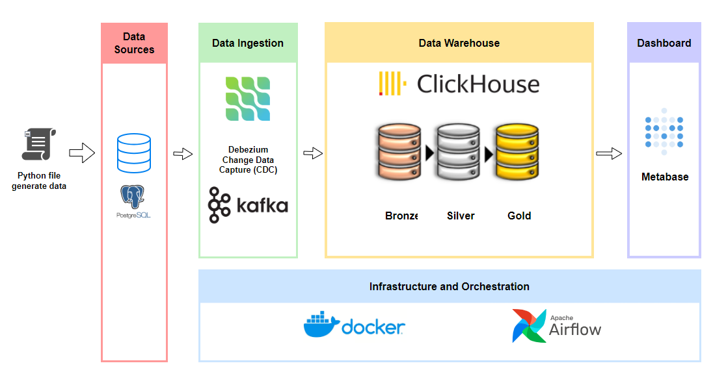

# E-Commerce Real-Time Data Pipeline

A local e-commerce analytics pipeline that moves transactional changes from PostgreSQL to ClickHouse through Debezium and Kafka. Airflow generates order activity; Metabase reads reporting views.



## Problem and approach

Running analytical joins on the checkout database competes with transactional work. This project separates the two workloads: PostgreSQL remains the source of truth, Debezium streams committed changes, and ClickHouse serves current sales and order metrics.

| Layer | Role |
|---|---|
| PostgreSQL + Airflow | Generate users, products, and complete order lifecycles |
| Debezium + Kafka | Capture and buffer changes from 22 source tables |
| ClickHouse Bronze | Retain CDC state, deletes, raw events, and malformed payloads |
| ClickHouse Silver / Gold | Resolve current entities and calculate business metrics |
| Metabase | Query five reporting views |

## Decisions in the data model

- Orders, items, payment records, and status history are written in one PostgreSQL transaction.
- Bronze versions each source key by Kafka offset and retains delete tombstones. A separate raw consumer keeps payloads; invalid JSON/envelopes go to quarantine.
- Silver and Gold are current-state views, so late updates, cancellations, deletes, and replay do not append duplicate sales.
- Sales include delivered orders only. Discounts are allocated to order lines before VAT is removed; overall AOV counts orders rather than product lines.
- Each order line captures its unit cost at purchase time. Pre-migration lines with unknown historical cost remain `NULL` in cost reporting.

This is a local demo. Gold query performance and end-to-end latency still need measurement under a sustained workload.

## Run locally

Requires Docker Compose v2, Python 3, `curl`, and `jq`. Allow roughly 8 GB RAM for the full stack.

```bash
git clone https://github.com/dungtran174/ecommerce-realtime-data-pipeline.git
cd ecommerce-realtime-data-pipeline
bash scripts/setup.sh
```

`setup.sh` creates `.env` from `.env.example` on first run, starts the services, applies schema migrations, registers the CDC connector, and waits for the core services. Review `.env` before exposing any ports outside a local machine.

- Airflow: `http://localhost:8080` (`admin` / `admin` by default). Enable the seed, catalog, user, and order DAGs to generate traffic.
- Metabase: `http://localhost:3000`. On first use, add a ClickHouse connection with host `clickhouse`, port `8123`, database `report`, and credentials from `.env`.
- Kafka UI: `http://localhost:8085`.

To check the warehouse after generating orders:

```bash
docker exec clickhouse clickhouse-client --query "SELECT count() FROM bronze.orders FINAL"
docker exec clickhouse clickhouse-client --query "SELECT count() FROM report.view_overview_orders"
```

Stop the stack while retaining data with `bash scripts/clean.sh`. The `--volumes` option also deletes persistent data.

## Stack

PostgreSQL 15 · Debezium 2.5 · Kafka 3.7 (KRaft) · ClickHouse 24 · Airflow 2.10 · Metabase · Docker Compose

MIT licensed.
