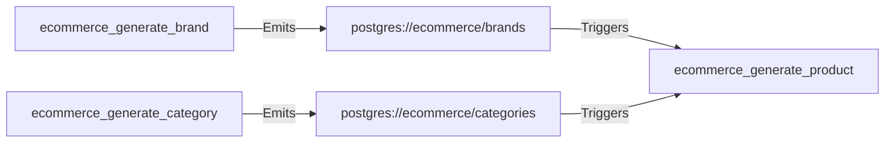
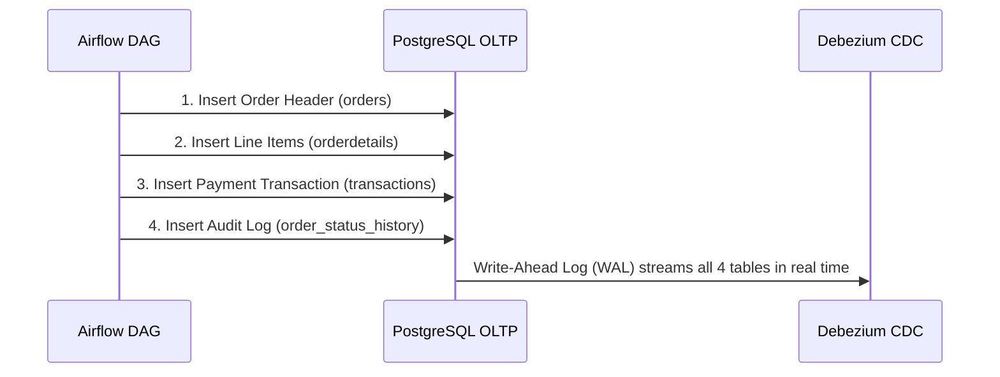

# Airflow Orchestration & Data Simulation

Apache Airflow plays two critical roles in this architecture:
1. **Realistic Transactional Simulation**: Simulating continuous e-commerce traffic, seed dimensions, customer registrations, and orders.
2. **Micro-batch ETL Scheduling**: Triggering the 5-minute aggregation job for `FACT_SALES_PRODUCT` in ClickHouse.

---

## 1. DAG Inventory & Categories

The pipeline contains 10 specialized DAGs divided into 4 operational categories:

| Category | DAG ID | Schedule | Purpose |
| :--- | :--- | :--- | :--- |
| **Foundation (Seed)** | `ecommerce_generate_province_and_city` | `@once` | Seeds 8 regions and 63 provinces of Vietnam |
| **Foundation (Seed)** | `ecommerce_generate_tag` | `@once` | Seeds 20 product search tags |
| **Weekly Batch** | `ecommerce_generate_brand` | `@weekly` | Generates brand names and emits `BRAND_DATASET` |
| **Weekly Batch** | `ecommerce_generate_category` | `@weekly` | Creates hierarchical categories and emits `CATEGORY_DATASET` |
| **Weekly Batch** | `ecommerce_generate_discount_and_campaign` | `@weekly` | Generates seasonal discount codes and ad campaigns |
| **Event-Driven** | `ecommerce_generate_product` | `Dataset-triggered` | Activated when brand or category datasets update |
| **Real-Time Simulation**| `ecommerce_user_registration` | `*/2 * * * *` | Simulates customer signups, roles, and addresses |
| **Real-Time Simulation**| `ecommerce_generate_order_process` | `*/3 * * * *` | Simulates orders, line items, payments, and statuses |
| **Analytical ETL** | `etl_fact_sales_product` | `*/5 * * * *` | Executes ClickHouse micro-batch aggregation |
| **Testing** | `ecommerce_test_single_order_manual` | `None` (Manual) | Generates exactly 1 order for end-to-end tracing |

---

## 2. Event-Driven Scheduling with Datasets

The product generation pipeline demonstrates Airflow's data-aware scheduling:

When either brands or categories change, `ecommerce_generate_product` automatically triggers to introduce new catalog inventory.

---

## 3. Order Lifecycle Simulation Flow

The core transactional engine `ecommerce_generate_order_process` models a complete purchase:

---

## 4. Operational Best Practices

### Accessing Airflow UI
- **URL**: `http://localhost:8080`
- **Default Credentials**: `admin` / `admin`

### Toggling Simulation Modes
- **Low Traffic / Manual Testing**: Turn off `ecommerce_generate_order_process` and trigger `ecommerce_test_single_order_manual` on demand.
- **High Traffic Simulation**: Unpause `ecommerce_user_registration` and `ecommerce_generate_order_process` to produce steady transaction volume.
