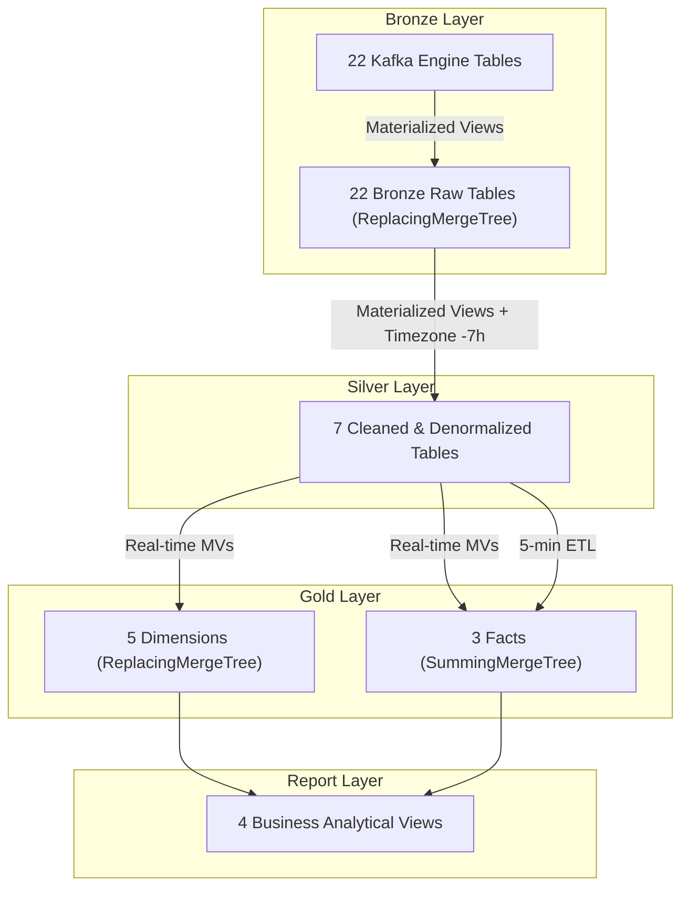

# ClickHouse Analytical Data Warehouse & Medallion Architecture

ClickHouse serves as the central real-time analytical warehouse (OLAP). It organizes data following the **Medallion Architecture** (Bronze → Silver → Gold → Report).

---

## 1. Medallion Layer Architecture



---

## 2. Layer Specifications

### Bronze Layer (`bronze.*`)
- **Ingestion**: Directly consumes from 22 Kafka CDC topics using ClickHouse's native `ENGINE = Kafka`.
- **Parallel Consumers**: High-throughput tables (`orders`, `orderdetails`) use `kafka_num_consumers = 4` to saturate available CPU cores.
- **Fault Tolerance**: Configured with `kafka_skip_broken_messages = 10` to bypass malformed records without halting the stream.
- **Raw Storage**: Data is piped via Materialized Views into `ReplacingMergeTree(_version)` tables, preserving timestamps via `fromUnixTimestamp64Milli(created_at)`.

### Silver Layer (`silver.*`)
- **Cleansing & Conformance**:
  - Eliminates leading/trailing whitespace using `trim()`.
  - Normalizes timezone offsets by applying `(created_at - INTERVAL 7 HOUR)`.
  - Converts currency strings safely using `toDecimal64(..., 2)`.
- **Denormalization**:
  - `silver.locations`: Merges provinces and regions into a unified location dimension.
  - `silver.products`: Merges products with brand and parent/child category hierarchies.
  - `silver.orders`: Enriches orders with location IDs, campaigns, and lookup descriptions.
  - `silver.order_items`: Computes line-item gross merchandise value (`gmv = quantity * current_price`).

### Gold Layer (`gold.*`)
Organized as a **Galaxy / Constellation Schema** with shared conforming dimensions:
- **Dimensions (`ReplacingMergeTree`)**:
  - `dim_date`: Pre-generated 10-year calendar table (2020–2029).
  - `dim_products`: Conformed product dimension seeded with default row `0: 'Unknown'`.
  - `dim_locations`: Geographic dimension with default fallback row `0: 'Unknown'`.
  - `dim_campaigns`: Marketing campaign dimension seeded with `0: 'No_Campaign'`.
  - `dim_order_status`: Standardized order status dimension (5 lifecycle states).
- **Facts (`SummingMergeTree`)**:
  - `FACT_USER_REGISTRATION`: Aggregates new user registrations per day.
  - `FACT_ORDER_OVERVIEW`: Pre-aggregates order counts and total GMV by date, city, status, and payment/shipping methods.
  - `FACT_SALES_PRODUCT`: Micro-batch aggregated every 5 minutes with order-level discount allocation:
    $$\text{Discount}_{\text{item}} = \left( \frac{\text{Price}_{\text{item}} \times \text{Qty}}{\text{Order\_Amount}} \right) \times \text{Discount\_Amount}$$

### Report Layer (`report.*`)
Flattened views providing clean interfaces for Metabase:
1. `view_marketing_dashboard`: Campaign ROI, Average Order Value (AOV), and product volume.
2. `view_overview_sales`: Daily/monthly revenue and bestselling products.
3. `view_overview_orders`: Order volume and delivery funnel metrics.
4. `view_overview_users`: User growth and retention trends.

---

## 3. Querying ClickHouse via CLI or HTTP

```bash
# Check raw row counts across all databases
curl -s "http://localhost:8123/" -d "
SELECT database, table, total_rows 
FROM system.tables 
WHERE database IN ('bronze', 'silver', 'gold', 'report') 
ORDER BY database, table"

# Inspect latency between source creation and warehouse storage
curl -s "http://localhost:8123/" -d "
SELECT 
    order_id, 
    created_at AS source_time, 
    updated_at AS warehouse_time,
    dateDiff('second', created_at, updated_at) AS latency_sec 
FROM silver.orders 
ORDER BY order_id DESC LIMIT 5"
```
