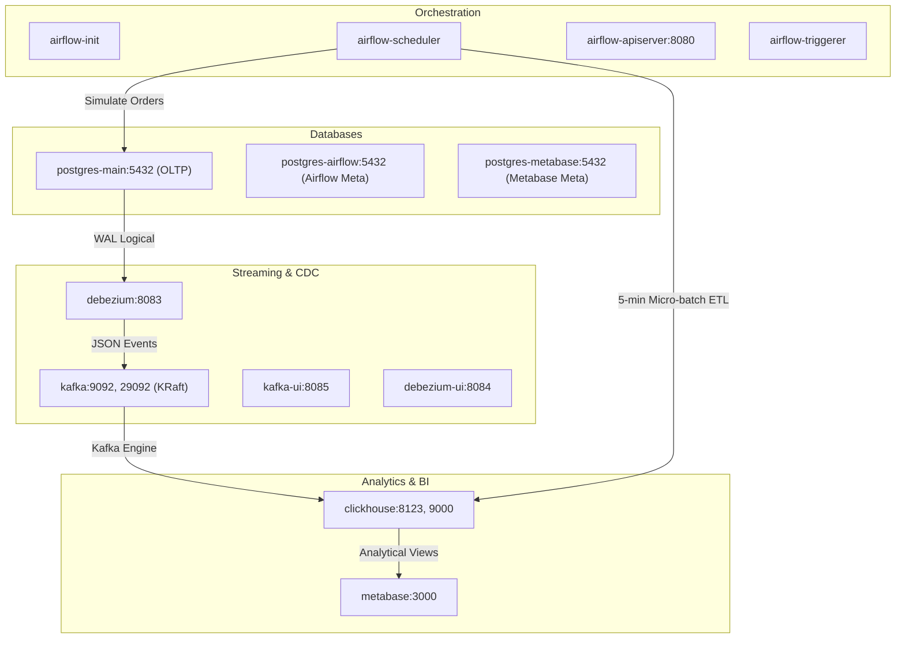

# Docker Infrastructure Architecture

The pipeline is packaged into containerized services managed via `docker-compose.yml`. All services communicate over an isolated bridge network named `ecommerce-data-pipeline`.

---

## 1. Services Overview

The deployment consists of 13 interconnected services:



---

## 2. Service Inventory

| Service | Image | Internal Port | Exposed Port | Purpose |
| :--- | :--- | :--- | :--- | :--- |
| `postgres-main` | `postgres:15` | `5432` | `5432` | E-commerce OLTP transactional database with logical replication enabled |
| `postgres-airflow` | `postgres:15` | `5432` | `5433` | Airflow metadata store (LocalExecutor) |
| `postgres-metabase` | `postgres:15` | `5432` | `5434` | Persistent store for Metabase dashboards and collections |
| `airflow-init` | Custom build | - | - | Runs DB migrations and provisions admin credentials |
| `airflow-scheduler` | Custom build | - | - | Schedules simulation DAGs and micro-batch ETL |
| `airflow-apiserver` | Custom build | `8080` | `8080` | Web UI and REST API server |
| `airflow-triggerer` | Custom build | - | - | Handles deferred operators and dataset events |
| `kafka` | `apache/kafka:3.7.0` | `29092` | `9092` | Single-node Kafka broker running in KRaft mode |
| `kafka-ui` | `provectuslabs/kafka-ui` | `8080` | `8085` | Web interface to monitor topics, offsets, and consumer groups |
| `debezium` | `quay.io/debezium/connect:2.5.0` | `8083` | `8083` | Kafka Connect worker capturing PostgreSQL WAL events |
| `debezium-ui` | `quay.io/debezium/debezium-ui:2.5` | `8080` | `8084` | Web UI for viewing connector status |
| `clickhouse` | `clickhouse/clickhouse-server:24` | `8123`, `9000` | `8123`, `9000` | Columnar OLAP engine running the Medallion warehouse |
| `metabase` | `metabase/metabase:latest` | `3000` | `3000` | Business Intelligence tool for analytical dashboards |

---

## 3. Network & Storage Volumes

### Virtual Network
All containers share the bridge network `ecommerce-data-pipeline`, allowing them to communicate via DNS service names (e.g., `kafka:29092`, `postgres-main:5432`, `clickhouse:8123`).

### Persistent Volumes
- `postgres-data`: Persists OLTP transactional records across restarts.
- `postgres-airflow-data`: Persists Airflow DAG run logs and variable state.
- `postgres-metabase-data`: Persists configured questions, dashboards, and users.
- `kafka-data`: Stores committed Kafka log segments.
- `clickhouse-data`: Stores MergeTree columnar data parts and table state.

---

## 4. Lifecycle Commands

```bash
# Start all services in detached mode
docker compose up -d

# Check real-time container status
docker compose ps

# Follow logs of a specific component
docker compose logs -f clickhouse
docker compose logs -f debezium

# Stop all containers
docker compose down

# Wipe all persistent data (clean slate)
docker compose down -v
```
